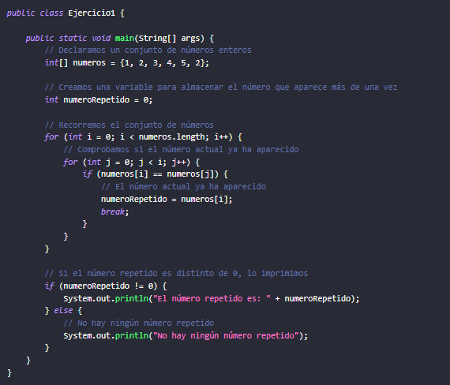
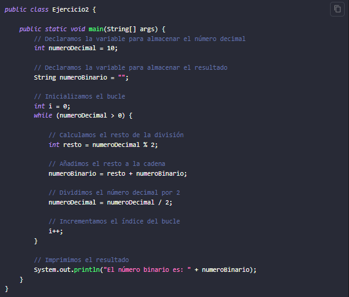
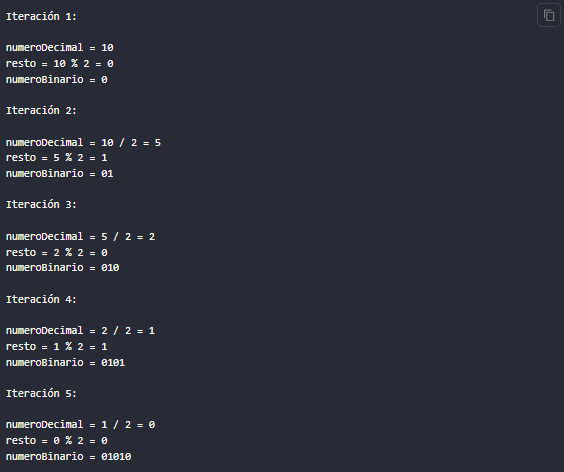
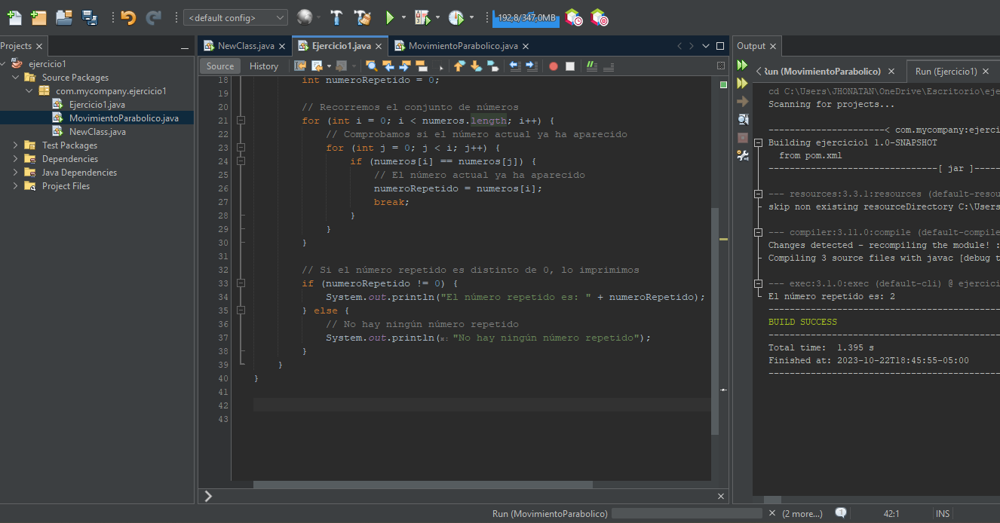

<!-- No borrar o modificar -->
[Inicio](./index.md)

## Sesión 11 

## Ejercicios de Lógica de Programación

### Ejercicio 1

Dado un conjunto de números enteros, se debe determinar si existe un número que aparezca más de una vez. Si existe, se debe imprimir su valor.

### Ejercicio 2

Conversión de decimal a binario. La conversión de decimal a binario es el proceso de convertir un número decimal a su representación binaria. El sistema binario es un sistema de numeración basado en dos dígitos, 0 y 1.

## Utilizando bucle for

Este algoritmo funciona dividiendo el número decimal por 2 repetidamente. Cada vez que se divide el número, el resto se almacena en la cadena. El proceso se repite hasta que el número decimal es 0.

Por ejemplo, para convertir el número decimal 10 a binario, el algoritmo funcionaría de la siguiente manera

## Actividad: Ejercicios de Lógica de Programación

1. Basándose en el algoritmo 1 de la sesión 11, aplicar la siguiente variante: Dado un conjunto de números enteros, se debe determinar si existe algún número que aparezca más de una vez. Si es así, se deben imprimir todos los números que aparezcan más de una vez.

2. Desarrollar un algoritmo que realice la conversión de binario a decimal.

## DESARROLLO

Este código utiliza un mapa para contar las ocurrencias de cada número y luego verifica cuáles números tienen un conteo mayor que 1, lo que significa que son los números repetidos. Los números repetidos se almacenan en una lista y se imprimen al final.

Solicitará al usuario la cantidad de números y se ingresan del 1 al 10 luego pedirá que ingreses los números uno por uno. Luego, buscará los números repetidos y los mostrará al final.

aca se muestra el ejemplo.

[Siguiente](./sesion12.md)

