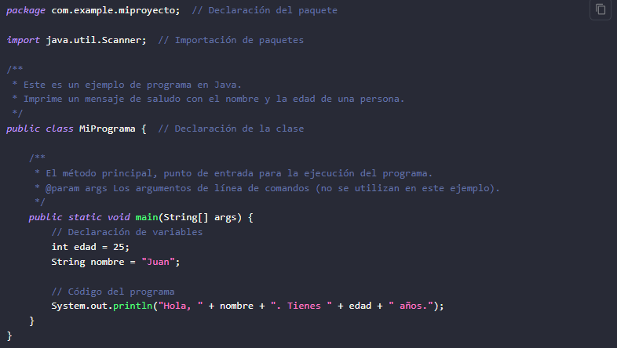

<!-- No borrar o modificar -->
[Inicio](./index.md)

## Sesión 2

<!-- Su documentación aquí -->
1035431495

# Instalación de Java y configuración del entorno de desarrollo

## Java JDK 

Java JDK (Java Development Kit) es un conjunto de herramientas de desarrollo de software que proporciona todo lo necesario para desarrollar, depurar y ejecutar aplicaciones Java. Incluye un conjunto de bibliotecas de clases predefinidas, compiladores, herramientas de depuración y otras utilidades necesarias para el desarrollo de aplicaciones Java. 

El JDK es esencial para cualquier desarrollador que quiera crear aplicaciones Java, ya que proporciona las herramientas necesarias para compilar el código fuente, crear archivos ejecutables y depurar el código en caso de errores. Además, el JDK se actualiza regularmente para incluir nuevas características y mejoras de rendimiento. 

 [Java JDK ](https://www.oracle.com/java/technologies/downloads/#jdk19-windows)  

## IntelliJ IDEA Community Edition

IntelliJ IDEA Community Edition es un entorno de desarrollo integrado (IDE) gratuito de JetBrains para la creación de aplicaciones Java y otros lenguajes de programación, como Kotlin, Groovy y Scala. Proporciona un conjunto de herramientas de desarrollo que incluyen un editor de código, un depurador, un compilador y una serie de características de refactorización y análisis de código.

La versión Community Edition de IntelliJ IDEA es gratuita y de código abierto, lo que significa que cualquier desarrollador puede descargar y utilizar la herramienta de forma gratuita. Además, cuenta con una gran comunidad de desarrolladores que contribuyen con complementos y soluciones para problemas comunes. La versión Community Edition es adecuada para proyectos pequeños y medianos, mientras que la versión Ultimate, de pago, ofrece características avanzadas para proyectos más grandes y complejos.

[IntelliJ IDEA Community Edition](https://www.jetbrains.com/es-es/idea/download/?section=windows#section=windows)

## NetBeans

NetBeans es un entorno de desarrollo integrado (IDE) de código abierto y gratuito, que proporciona un conjunto de herramientas para desarrollar software en diferentes lenguajes de programación, como Java, C, C++, HTML, CSS y JavaScript, entre otros.

NetBeans es una herramienta multiplataforma, lo que significa que se puede ejecutar en diferentes sistemas operativos como Windows, Mac OS y Linux. Proporciona un editor de código, depurador, compilador y otras características esenciales para la programación, como refactorización de código, autocompletado de código y soporte de control de versión.

Además, NetBeans cuenta con una comunidad activa de desarrolladores que contribuyen con complementos y soluciones a problemas comunes, lo que lo convierte en una herramienta muy versátil y adaptable a diferentes proyectos y necesidades de programación.

[NetBeans](https://netbeans.apache.org/download/nb18/)

## Estructura de un programa en Java

Ejemplo de la estructura de un programa en Java con comentarios documentados para cada sección:

**En este ejemplo, se sigue la estructura básica de un programa en Java con comentarios documentados que explican cada sección:**

* package com.example.miproyecto;: Se declara el paquete al que pertenece el programa. En este caso, el paquete es "com.example.miproyecto".

* import java.util.Scanner;: Se importa el paquete java.util y la clase Scanner para poder utilizarla en el programa. El Scanner se utiliza para leer la entrada del usuario.

* public class MiPrograma {: Se declara la clase principal del programa llamada MiPrograma. La palabra clave public indica que la clase es accesible desde cualquier otro lugar.

* public static void main(String[] args) {: Se define el método principal main, que es el punto de entrada del programa. Recibe un array de cadenas args como argumento, que puede ser utilizado para pasar argumentos desde la línea de comandos.

* int edad = 25;: Se declara una variable edad de tipo entero y se le asigna el valor 25.

* String nombre = "Juan";: Se declara una variable nombre de tipo cadena y se le asigna el valor "Juan".

* System.out.println("Hola, " + nombre + ". Tienes " + edad + " años.");: Se utiliza System.out.println() para imprimir un mensaje de saludo en la consola. La cadena se forma concatenando las variables nombre y edad utilizando el operador de suma (+).